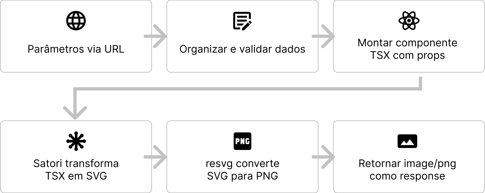
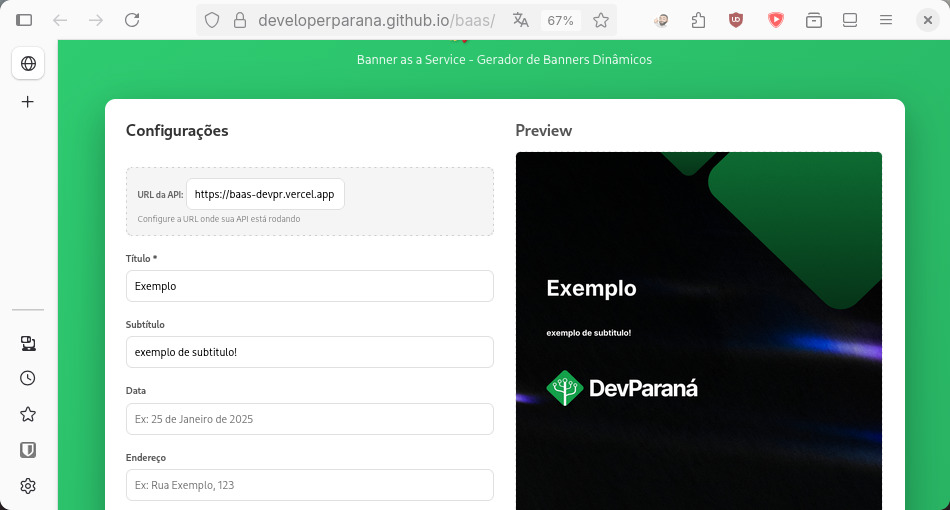

Recentemente me peguei pensando em como funcionam aquelas thumbnails que aparecem quando compartilhamos um link nas redes sociais. Essa curiosidade me levou a descobrir as OG Images, um protocolo desenvolvido pela Meta que permite definir imagens personalizadas através de meta tags no head do HTML. Inclusive, se você compartilhar o link deste blog, vai ver que ele também tem sua própria OG Image.


## Da curiosidade à aplicação

Inicialmente, dei uma olhada na solução da Vercel para Next.js: `@vercel/og`. É uma ferramenta robusta e bem integrada ao Next, mas eu queria entender como é que eles faziam isso, pra eu poder ter mais liberdade para implementar em ambientes diferentes =P

Foi então que descobri o [Satori](https://github.com/vercel/satori), a lib open-source que a própria Vercel desenvolveu e que serve como base para sua solução do Next.js, ele basicamente interpreta JSX e converte em SVG. O interessante é que não envolve DOM, já que tudo é processado diretamente pelo Satori.

Foi quando veio o estalo na cabeça: eu poderia usar essa tecnologia para criar um gerador de banners para a comunidade [DevParaná](https://devpr.org/)!! A realidade é que muitos devs nem sempre tem familiaridade com as ferramentas de design, e isso seria uma excelente ajuda pro pessoal poder divulgar os eventos

Combinando Express + Satori + resvg, criei o gerador de banners. A ideia é expor um endpoint `/image/` e receber os parâmetros da imagem via query string. Assim posso montar um link e usar diretamente no `src=""` de qualquer aplicação, como inclusive estou usando neste artigo no exemplo acima hehe

```html

```

O fluxo para gerar as imagens segue os seguintes passos:



## Vantagens dessa abordagem

- **Segurança:** como não há browser headless como Puppeteer envolvido e não há acesso ao DOM, não precisamos nos preocupar com ataques XSS vindos dos parâmetros.

- **Performance:** acaba sendo mais rápido que soluções de browser headless, porque não inicializa um navegador novo e processa apenas aquilo que é necessário para o SVG.

- **Flexibilidade:** atualmente o Express retorna `Content-Type: image/png`, mas como o Satori gera SVG antes do resvg converter para PNG, poderíamos mudar para retornar SVG diretamente. Isso é útil se você quiser editar a imagem no Figma, já que não perde as camadas de vetor.

- **Componentização:** como o projeto é em TSX, você pode criar vários componentes diferentes. Se passar o parâmetro `media=stories`, por exemplo, gera o mesmo banner mas no formato ideal para stories: 1080x1920.

- **As possibilidades são diversas:** Gerador de certificados, criador de comprovantes, thumbnails personalizadas... _basicamente qualquer coisa relacionada_...

## Desafios e soluções

- **Fontes customizadas:** como o Satori não tem DOM, não reconhece fontes do sistema. A solução foi baixar os arquivos manualmente e injetá-los durante a renderização.

- **Limitações do CSS:** o Satori utiliza o [mesmo layout engine que o React Native](https://github.com/vercel/satori?tab=readme-ov-file#css), então ele não suporta CSS tradicional e todos os elementos precisam ter tamanhos definidos explicitamente.

- **Imagens:** precisei hospedar as imagens no Cloudflare R2, já que o Satori não acessa caminhos locais. A vantagem é o plano gratuito, 10gb de armazenamento :))

---

## Próximas etapas e melhorias planejadas

**Cache:** quero desenvolver um mecanismo de cache que armazenará as imagens geradas no Cloudflare R2. A lógica é simples: cada combinação única de parâmetros gera uma chave identificadora. Antes de renderizar uma nova imagem, o sistema verifica se já existe uma versão cached. Isso reduz drasticamente o tempo de resposta para requisições repetidas :))

**Abstração para customização:** os parâmetros atuais são específicos para as necessidades do DevParaná, mas a arquitetura suporta praticamente qualquer tipo de customização. Quero montar uma versão "base" do projeto, removendo as referências específicas e criando uma versão limpa que qualquer pessoa possa forkar e adaptar para seus próprios casos de uso

## Colaboração e experimentação

Um agradecimento especial ao [Luiz Schons](https://github.com/sschonss), que não apenas entrou na empolgação do projeto como também desenvolveu a interface que torna a experiência de criação de banners muito mais acessível. Também um agradecimento ao meu amigo [Tailan](https://tailan.pro/) que me ajudou a organizar as ideias para tirar esse projeto do papel!

Você pode experimentar o [playground](https://developerparana.github.io/baas/) e ver na prática como os parâmetros alteram a imagem



O repositório no GitHub está aberto para contribuições, sugestões e forks. Acredito que soluções como esta podem ajudar muitas comunidades e projeto, fique a vontade para contribuir ;)

::github{repo="DeveloperParana/baas"}
